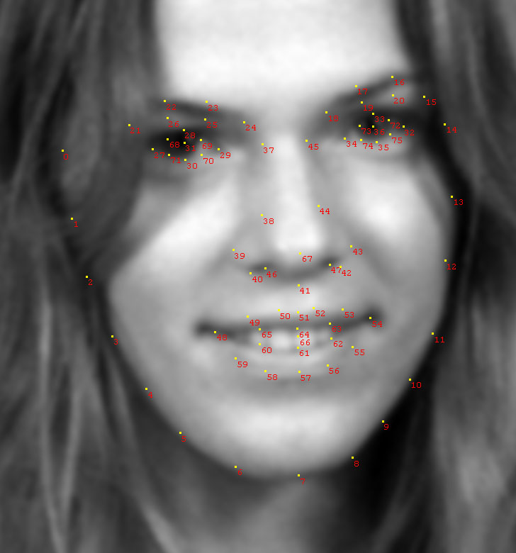
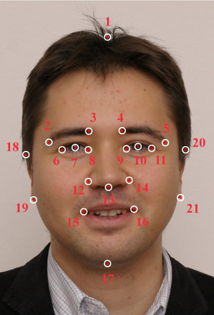
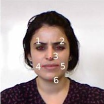
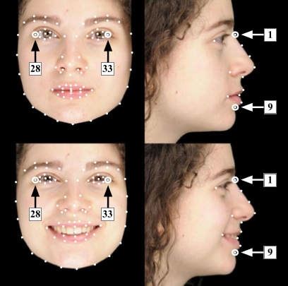
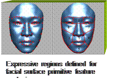
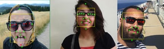
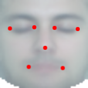
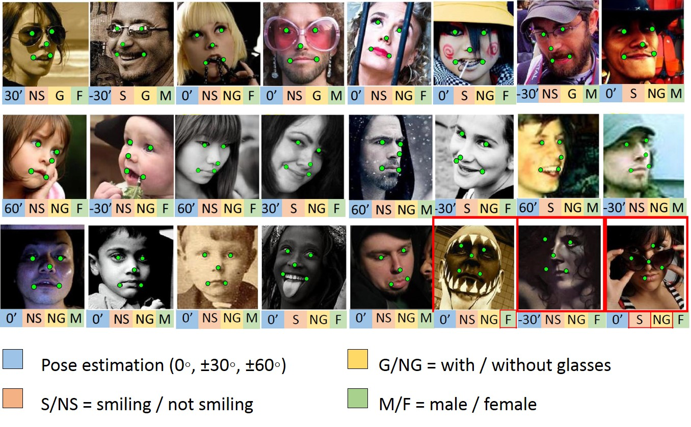
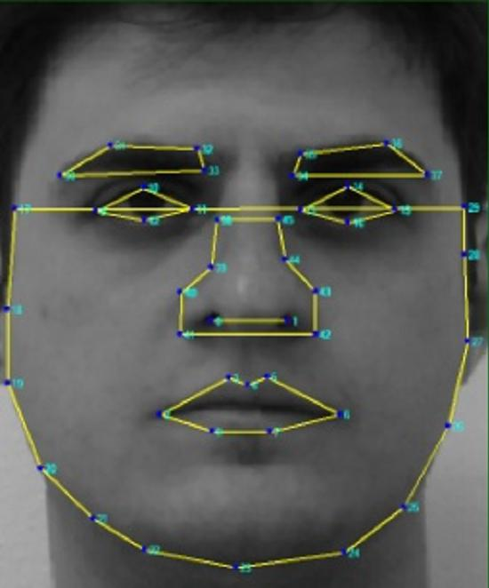
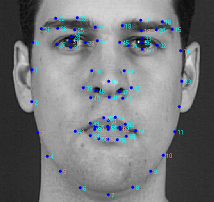

## Faces Landmarks Datasets  

### Index
[BU-3DFE (Binghamton University 3D Facial Expression) Database (Static Data)](#bu-3dfe)  
[Denver Intensity of Spontaneous Facial Action (DISFA)](#disfa)  
[Eurecom Kinect Face Dataset](#eurecom)  
[FEI Face Database](#fei)  
[MUCT](#muct)  
[Multi-Task Facial Landmark (MTFL) dataset](#mtfl)  
[PUT Face Database](#put)  
[SCface - Surveillance Cameras Face Database](#scface)  
[SCUT-FBP5500-Database-Release](#scut)  
[SiblingsDB](#siblingsdb)  
[Specs on Faces (SoF) Dataset](#sof)  
[The IMM Frontal Face Database](#imm-frontal)  
[UMB-DB: The University of Milano Bicocca 3D Face Database](#umb-db)  
[VGGFACE2](#vggface2)  
[XM2VTS 68pt Markup](#xm2vts)  

---

### Datasets

landmark如何选择loss，以及如何提升精度
https://blog.csdn.net/u011995719/article/details/80150508

read
https://www.jianshu.com/p/e4b9317a817f

Name:ibug3000
Link: http://dlib.net/files/data/

Name: FAN
https://www.adrianbulat.com/face-alignment

http://www.ifp.illinois.edu/~vuongle2/helen/
https://github.com/TomaszRewak/Face-Landmarking

Name: **MUCT**  
Link: http://www.milbo.org/muct/  
Description: The MUCT database consists of 3755 faces with 76 manual landmarks. The database was created to provide more diversity of lighting, age, and ethnicity than currently available landmarked 2D face databases.  
Size: 3755 images (3755 faces)  
Landmarks: 76  
Free: Yes  
Example:  
  

Name: **PUT Face Database**  
Link: http://biometrics.put.poznan.pl/put-face-database/  
Description: (too long)  
Size: 9971 images (100 subjects)  
Landmarks: 194  
Free: Yes  
Example:  

Name: **SCface - Surveillance Cameras Face Database**  
Link: http://www.scface.org (dataset) - https://atvs.ii.uam.es/atvs/scfacedb_landmarks.html (landmarks)  
Description: SCface is a database of static images of human faces. Images were taken in uncontrolled indoor environment using five video surveillance cameras of various qualities. Database contains 4160 static images (in visible and infrared spectrum) of 130 subjects. Images from different quality cameras mimic the real-world conditions and enable robust face recognition algorithms testing, emphasizing different law enforcement and surveillance use case scenarios.  
Size: 4160 images (130 subjects)  
Landmarks: 21  
Free: Yes  
Example:  
  

Name: **Eurecom Kinect Face Dataset**  
Link: http://rgb-d.eurecom.fr  
Description: The Dataset consists of the multimodal facial images of 52 people (14 females, 38 males) obtained by Kinect. (...)  each person in 9 states of different facial expressions, different lighting and occlusion conditions: neutral, smile, open mouth, left profile, right profile, occlusion eyes, occlusion mouth, occlusion paper and light (...)  In addition, the dataset comes with the manual landmarks of 6 positions in the face: left eye, right eye, the tip of nose, left side of mouth, right side of mouth and the chin (...)  
Size: 468 images (52 subjects)  
Landmarks: 6  
Free: Yes  
Example:  
  

Name: **SiblingsDB**  
Link: https://areeweb.polito.it/ricerca/cgvg/siblingsDB.html  
Description: The first, called HQfaces, contains a set of high quality images depicting 184 individuals (92 pairs of siblings). A subset of 79 pairs contains profile images as well, and 56 of them have also smiling frontal and profile pictures. The images, with resolution 4256x2832, were shot by a professional photographer with uniform background and controlled lighting. The subjects are voluntary students and employees of the Politecnico di Torino and their siblings, in the age range between 13 and 50 (average 23.1). The highest and average age differences between siblings are 30 and 4.6 years, respectively. All subjects are Caucasian and 57% of them are male. Subjects were asked not to wear make-up.  
Size: Calculating...  
Landmarks: 76  
Free: Yes  
Example:  
  

Name: **Denver Intensity of Spontaneous Facial Action (DISFA)**  
Link: http://www.engr.du.edu/mmahoor/DISFA.htm  
Description: This database contains stereo videos of 27 adults subjects (12 females and 15 males) with different ethnicity. The images were acquired using PtGrey stereo imaging system at high resolution (1024x768). The intensity of AUs (0-5 scale) for all video frames were manually scored by two human FACS experts. The database also includes 66 facial landmark points of each image in the database.  
Size: Calculating...  
Landmarks: 66  
Free: Yes  
Example:  

Name: **BU-3DFE (Binghamton University 3D Facial Expression) Database (Static Data)**  
Link: http://www.cs.binghamton.edu/~lijun/Research/3DFE/3DFE_Analysis.html  
Description: The database presently contains 100 subjects (56% female, 44% male), ranging age from 18 years to 70 years old, with a variety of ethnic/racial ancestries, including White, Black, East-Asian, Middle-east Asian, Indian, and Hispanic Latino. Participants in face scans include undergraduates, graduates and faculty from our institute’s departments of Psychology, Arts, and Engineering (Computer Science, Electrical Engineering, System Science, and Mechanical Engineering). The majority of participants were undergraduates from the Psychology Department (collaborator: Dr. Peter Gerhardstein). Each subject performed seven expressions in front of the 3D face scanner. With the exception of the neutral expression, each of the six prototypic expressions (happiness, disgust, fear, angry, surprise and sadness) includes four levels of intensity. Therefore, there are 25 instant 3D expression models for each subject, resulting in a total of 2,500 3D facial expression models in the database. Associated with each expression shape model, is a corresponding facial texture image captured at two views (about +45° and -45°). As a result, the database consists of 2,500 two-view’s texture images and 2,500 geometric shape models.  
Size: 2500 images (100 subjects)  
Landmarks:  
Free: Yes  
Example:  
  

Name: **Specs on Faces (SoF) Dataset**  
Link: https://sites.google.com/view/sof-dataset  
Description: Welcome to the Specs on Faces (SoF) dataset, a collection of 42,592 (2,662×16) images for 112 persons (66 males and 46 females) who wear glasses under different illumination conditions. The dataset is FREE for reasonable academic fair use. The dataset presents a new challenge regarding face detection and recognition. It is focused on two challenges: harsh illumination environments and face occlusions, which highly affect face detection, recognition, and classification. The glasses are the common natural occlusion in all images of the dataset. However, there are two more synthetic occlusions (nose and mouth) added to each image. Moreover, three image filters, that may evade face detectors and facial recognition systems, were applied to each image. All generated images are categorized into three levels of difficulty (easy, medium, and hard). That enlarges the number of images to be 42,592 images (26,112 male images and 16,480 female images). There is metadata for each image that contains many information such as: the subject ID, facial landmarks, face and glasses rectangles, gender and age labels, year that the photo was taken, facial emotion, glasses type, and more.  
Size: 42592 images (112 subjects)  
Landmarks: 17  
Free: Yes  
Example:  
  

Name: **UMB-DB: The University of Milano Bicocca 3D Face Database**  
Link: http://www.ivl.disco.unimib.it/minisites/umbdb//description.html  
Description: The University of Milano Bicocca 3D face database is a collection of multimodal (3D + 2D colour images) facial acquisitions. The database is available to universities and research centers interested in face detection, face recognition, face synthesis, etc. The UMB-DB has been acquired with a particular focus on facial occlusions, i.e.scarves, hats, hands, eyeglasses and other types of occlusion wich can occur in real-world scenarios. See the Publications section for a selection of our papers about face detection, face recognition and other face-related topics.  
Size: 1473 images (143 subjects)  
Landmarks: 7  
Free: Yes  
Example:  
  

Name: **VGGFACE2**  
Link: http://www.robots.ox.ac.uk/~vgg/data/vgg_face2/  
Description: The dataset contains 3.31 million images of 9131 subjects (identities), with an average of 362.6 images for each subject. Images are downloaded from Google Image Search and have large variations in pose, age, illumination, ethnicity and profession (e.g. actors, athletes, politicians). The whole dataset is split to a training set (including 8631 identites) and a test set (including 500 identites).  
Size: 3.31 million images (9131 subjects)  
Landmarks: 5  
Free: Yes  
Example:  

Name: **Multi-Task Facial Landmark (MTFL) dataset**  
Link: http://mmlab.ie.cuhk.edu.hk/projects/TCDCN.html  
Description:  This dataset contains 12,995 face images which are annotated with (1) five facial landmarks, (2) attributes of gender, smiling, wearing glasses, and head pose.  
Size: 12995 images  
Landmarks: 5  
Free: Yes  
Example:  
  

Name: **SCUT-FBP5500-Database-Release**  
Link: https://github.com/HCIILAB/SCUT-FBP5500-Database-Release  
Description: The SCUT-FBP5500 dataset has totally 5500 frontal faces with diverse properties (male/female, Asian/Caucasian, ages) and diverse labels (facial landmarks, beauty scores in 5 scales, beauty score distribution), which allows different computational model with different facial beauty prediction paradigms, such as appearance-based/shape-based facial beauty classification/regression/ranking model for male/female of Asian/Caucasian.  
Size: 5500 images (5500 faces)  
Landmarks: 86  
Free: Yes  
Example:  

Name: **The IMM Frontal Face Database**  
Link: http://www2.imm.dtu.dk/pubdb/views/publication_details.php?id=3943  
Description: This note describes a data set consisting of 120 annotated monocular images of 12 different frontal human faces. Points of correspondence are placed on each image so the data set can be readily used for building statistical models of shape.  
Size: 120 images (12 subjects)  
Landmarks: 73  
Free: Yes  
Example:  

Name: **FEI Face Database**  
Link: https://fei.edu.br/~cet/facedatabase.html  
Description: ... In addition, we provide a subset of the FEI face database composed of only frontal face images previously aligned to a common template so that the pixel-wise features extracted from the images correspond roughly to the same location across all subjects. In this manual alignment, we have randomly chosen the frontal image of a subject as template and the directions of the eyes and nose as a location reference. All these frontal images were then cropped to the size of 360x260 pixels. Since the number of subjects is equal to 200 and each subject has two frontal images (one with a neutral or non-smiling expression and the other with a smiling facial expression), there are 400 full frontal face images manually registered to evaluate experiments on a controlled environment.  
Size: 400 images (200 subjects)  
Landmarks: 46  
Free: Yes  
Example:  
  

Name: **XM2VTS 68pt Markup**  
Link: https://personalpages.manchester.ac.uk/staff/timothy.f.cootes/data/xm2vts/xm2vts_markup.html  
Description: The XM2VTS frontal data set contains 2360 mug shots of 295 individuals collected over 4 sessions.  
Size: 2360 images (295 subjects)  
Landmarks: 68  
Free: Yes  
Example:  
  